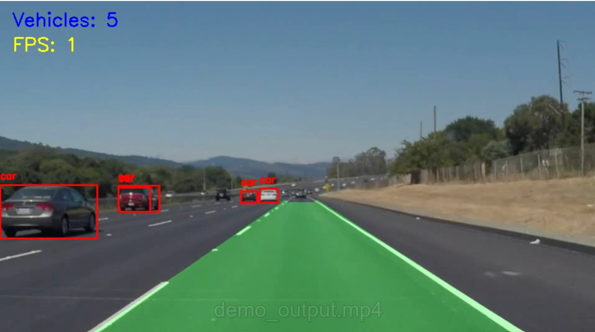
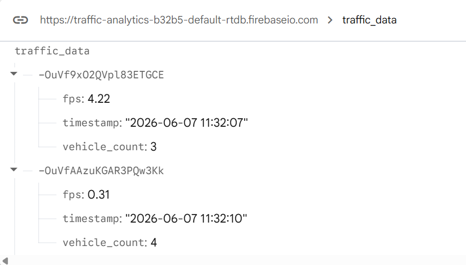

# 🚦 Smart Traffic Analytics System using OpenCV, YOLOv8 and Firebase

## 📖 Overview

This project implements an intelligent traffic analytics system using Python, OpenCV, YOLOv8, and Firebase. The system detects lane boundaries, identifies vehicles on the road, counts vehicles in real time, monitors processing performance through FPS calculation, and uploads traffic statistics to Firebase Realtime Database for cloud-based analytics.

## 🎯 Problem Statement

Traditional traffic monitoring systems require expensive infrastructure and manual analysis. This project provides an intelligent and cost-effective solution for lane detection, vehicle monitoring, traffic analytics, and cloud-based data logging using Computer Vision and AI technologies.

## ✨ Features

* Real-time Lane Detection
* Region of Interest (ROI) Masking
* Canny Edge Detection
* Hough Line Transform
* Lane Area Highlighting
* YOLOv8 Vehicle Detection
* Vehicle Counting
* FPS Monitoring
* Firebase Realtime Database Integration
* Cloud-Based Traffic Analytics
* Video Processing and Visualization

## 🛠️ Technologies Used

* Python
* OpenCV
* NumPy
* YOLOv8 (Ultralytics)
* Firebase Realtime Database
* Firebase Admin SDK

## 📂 Project Structure

smart-traffic-analytics-system/

├── assets/
│   ├── output_demo.png
│   └── firebase_dashboard.png

├── outputs/

├── src/
│   ├── lane_detector.py
│   ├── vehicle_detector.py
│   ├── cloud_logger.py
│   ├── utils.py
│   └── pipeline.py

├── requirements.txt
├── README.md
└── .gitignore

## 🔄 System Workflow

1. Read video frames using OpenCV.
2. Detect lane boundaries using image processing techniques.
3. Detect vehicles using YOLOv8.
4. Count detected vehicles.
5. Calculate real-time FPS.
6. Upload traffic statistics to Firebase.
7. Display processed output video.

## 📋 Output Information

The system displays:

* Lane Area Detection
* Vehicle Bounding Boxes
* Vehicle Count
* FPS Value
* Cloud Logged Traffic Data

## ☁️ Firebase Cloud Logging

Traffic analytics data is uploaded to Firebase Realtime Database.

Stored fields:

* Vehicle Count
* FPS
* Timestamp

Example:

Vehicle Count: 4

FPS: 4.22

Timestamp: 2026-06-07 11:32:07

## 🏆 Key Achievements

✔ Real-time lane detection using OpenCV

✔ Vehicle detection and counting using YOLOv8

✔ FPS monitoring for performance analysis

✔ Cloud-based traffic analytics using Firebase

✔ Automated traffic data logging with timestamps

## 🚀 Future Enhancements

* Lane Departure Warning System
* Vehicle Speed Estimation
* Distance Estimation
* Car/Truck/Bus Classification
* Curved Lane Detection
* ADAS Dashboard
* Cloud Analytics Dashboard
* Real-Time Camera Integration

## 📈 Results

The Smart Traffic Analytics System successfully:

- Detects and highlights road lanes
- Identifies vehicles using YOLOv8
- Counts vehicles in real time
- Calculates processing FPS
- Uploads traffic analytics to Firebase Realtime Database
- Provides a foundation for future ADAS applications

## 📸 Screenshots

### Lane and Vehicle Detection

### Firebase Cloud Analytics

## Author

**Shwethashree S**

B.Tech Information Science and Engineering
Presidency University, Bangalore
