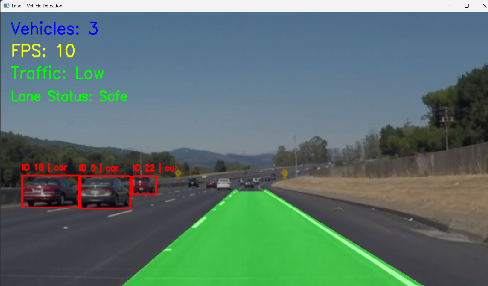
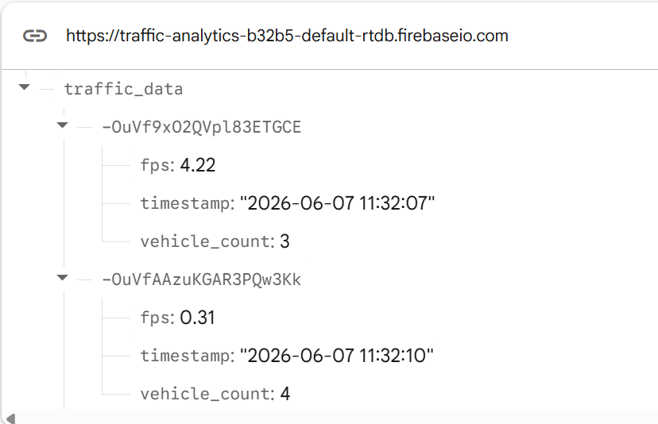

# 🚦 Smart Traffic Analytics System using OpenCV, YOLOv8 and Firebase


## 📖 Overview

Smart Traffic Analytics System is a computer vision-based application built with Python, OpenCV, YOLOv8, and Firebase for real-time traffic monitoring. It detects lanes, tracks vehicles, classifies traffic density, generates lane departure warnings, and uploads traffic analytics to Firebase Realtime Database.

## 📸 Screenshots

### Lane and Vehicle Detection



### Firebase Cloud Analytics




## ✨ Features

* Real-time Lane Detection
* YOLOv8 Vehicle Detection
* Vehicle Tracking and Counting
* Traffic Density Classification
* Lane Departure Warning System
* FPS Monitoring
* Firebase Realtime Database Integration
* Cloud-Based Traffic Analytics
* Video Processing and Visualization


## 🛠️ Tech Stack

* Python
* OpenCV
* NumPy
* YOLOv8 (Ultralytics)
* Computer Vision
* Firebase Realtime Database
* Firebase Admin SDK

## 📂 Project Structure

```text

smart-traffic-analytics-system/
├── assets/
│   ├── output_demo.png
│   └── firebase_dashboard.png
├── outputs/
├── src/
│   ├── lane_detector.py
│   ├── vehicle_detector.py
│   ├── cloud_logger.py
│   ├── utils.py
│   └── pipeline.py
├── requirements.txt
├── README.md
└── .gitignore

```

## 🔄 Workflow

1. Read video frames.
2. Detect lane boundaries.
3. Detect and track vehicles using YOLOv8.
4. Classify traffic density.
5. Generate lane departure warnings.
6. Upload analytics to Firebase.
7. Display the processed video with analytics overlays.

## ☁️ Firebase Integration

Traffic statistics, including vehicle count, FPS, and timestamps, are uploaded to Firebase Realtime Database every 5 seconds for cloud-based monitoring and analytics.


## ⚙️ Installation

```bash
git clone https://github.com/Shwetha8730/smart-traffic-analytics-system.git

cd smart-traffic-analytics-system

pip install -r requirements.txt

python src/pipeline.py
```


## 🚀 Future Enhancements

* Vehicle Speed Estimation
* Distance Estimation
* DeepSORT / ByteTrack Integration
* Collision Warning System
* Curved Lane Detection
* ADAS Dashboard
* Cloud Analytics Dashboard
* Real-Time Camera Integration


## 👩‍💻 Author

**Shwethashree S**

B.Tech – Information Science and Engineering  

Presidency University, Bangalore